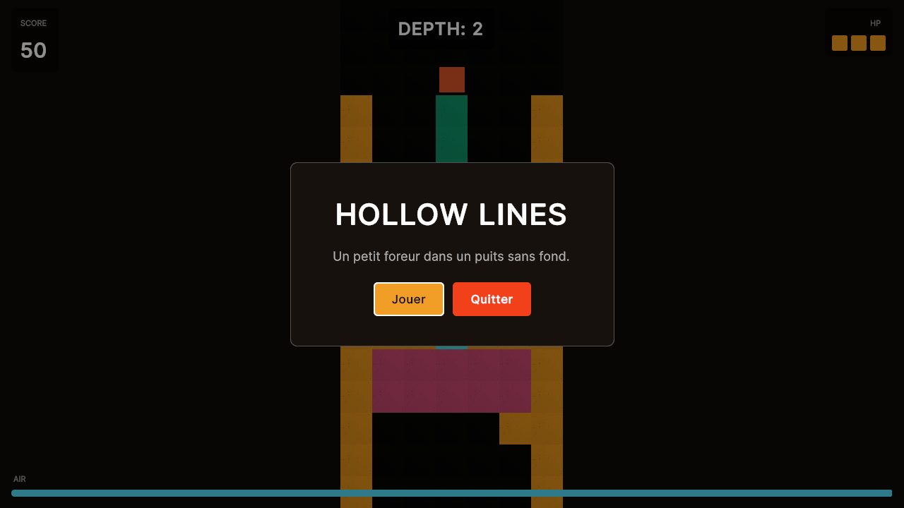
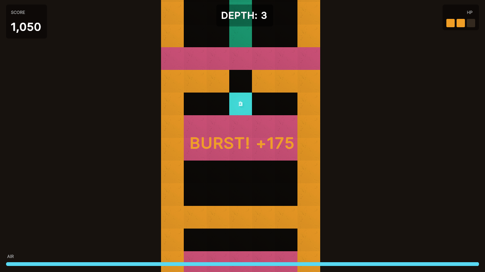
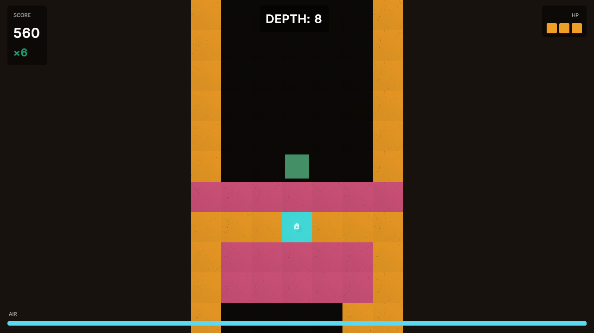
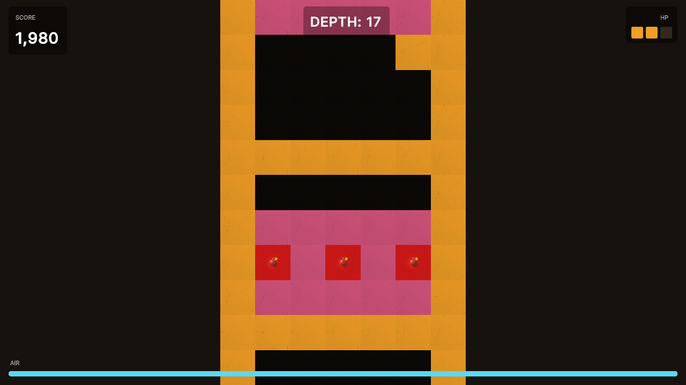

# Hollow Lines

**An arcade action-descent: a tiny pixel-art driller falls down a well that never ends.**


-blue)


[](https://fredericlevesque.itch.io/hollow-lines)
[](https://youtu.be/x_PMjnCzcxU)

Drill straight down for rising color combos, undermine huge chunks so they shatter on
impact, chain bombs together for massive bursts, blow up Boomers to amplify the chaos,
and grab diamonds on the way past — all while the air runs out. This is a score-chaser,
not a puzzle game: **nothing ever asks you to stop descending.** Campaign teaches you the
ropes; Endless is the real game: how deep can you go?

<p align="center">
  <a href="https://youtu.be/x_PMjnCzcxU">
    
  </a>
  
  <br/>
  
  
</p>

<p align="center">
  <strong>🕹️ <a href="https://fredericlevesque.itch.io/hollow-lines">Play on itch.io</a></strong>
  &nbsp;&nbsp;·&nbsp;&nbsp;
  <strong>📺 <a href="https://youtu.be/x_PMjnCzcxU">Watch gameplay on YouTube</a></strong>
</p>

---

## Table of contents

- [What is this](#what-is-this)
- [Core mechanics](#core-mechanics)
- [Game modes](#game-modes)
- [Engineering highlights](#engineering-highlights)
- [Project structure](#project-structure)
- [Getting started](#getting-started)
- [Running the tests](#running-the-tests)
- [Status / roadmap](#status--roadmap)
- [Credits](#credits)
- [License](#license)

---

## What is this

Hollow Lines is an **arcade action-descent** — think **Mr. Driller**'s avatar-in-a-well
physics crossed with **Downwell**'s score-chasing depth run. You dig, blocks fall, chunks
of the same color fuse into rigid slabs that crash down and shatter, bombs chain into each
other, buried enemies get flattened by the debris, and the well never stops going down.

The design got there in two passes, both documented in
[`hollow-lines-gdd-v3.md`](hollow-lines-gdd-v3.md):

- **v2.1 → v3** — a full mechanical redesign after prototyping showed the original "clear a
  full row of empty cells" loop was too cerebral for the arcade feel the game was chasing.
  v3 rebuilt scoring around things that reward *every* drill tap instead of an abstract
  goal layered on top of it.
- **v3 → v3.1 (the arcade pivot)** — a pairwise analysis of the shipped v3 systems found
  several that quietly asked the player to **stop descending**: the color streak rewarded
  lateral routing, the diamond gate forced collection detours, and two of the planned enemy
  types were puzzles to be solved. Each one was either made passive or made optional.

> Every drill tap is the reward, not a means to some other goal. Spectacle and score are
> aligned — the biggest, loudest plays are also the highest-scoring ones — and no mechanic
> is allowed to interrupt the descent to get at it.

## Core mechanics

| System | What it does |
|---|---|
| 🎨 **Color Streak** | Drilling **downward** on the same color back-to-back multiplies your points. Colors generate in *veins*, not random noise, so a straight-down dig routinely builds a ×4–×8 streak. Sideways and upward drills are streak-neutral — the streak is a reward for descending, never a reason to detour. |
| 💥 **Chunk Burst** | Same-color blocks fuse into rigid chunks. Undermine one and it falls — 2+ rows of fall distance and it shatters on impact for a big payout, plus a shockwave that frees capsules and diamonds, arms nearby bombs, and flattens anything living in the blast. |
| 🧨 **Bomb Bonanza** | Buried bombs arm when you drill next to them, then burn a 1.5 s fuse with an accelerating beep-and-flash telegraph. Chain several together for a rising multiplier — bombs liberate air and diamonds instead of destroying them, so they're a tool, not a hazard. |
| 🐛 **Enemies** | Two kinds, both killed by *physics* rather than combat — you never fight them, you drop things on them. Both lie buried and inert until you drill nearby. **Crawlers** then shuffle along their row and cost you a heart if they reach you. **Boomers** never move and never touch you — but kill one and it explodes, destroying more blocks and potentially setting off other Boomers (chain capped 3 deep). Enemies amplify what you were already doing; they never block the way down. |
| 💎 **Diamonds** | Free candy scattered on the way down — never behind an unbreakable wall, never gated. Grab one for +150 if it's on your path, ignore it if it isn't. |
| 🕳️ **Depth** | Every new deepest row banks points on its own. The well only ever pulls you forward. |
| ⭐ **Perfect Clear** | Clearing a full row of empties is a rare secret jackpot (+500 flat) — not the core loop, just a bonus for players who go looking for it. |
| 💨 **Air** | Constantly draining, and **every single drill puts some back**, alongside capsules, bursts and bomb chains. Standing still to plan is what kills you; drilling *is* survival. |

## Game modes

- **Tutorial showcase** — a hand-authored, deterministic intro board that teaches every
  mechanic above in its own isolated chamber before you ever see a procedural level.
- **Campaign** — 10 hand-tuned procedural levels, each introducing one new mechanic
  (streaks → chunk bursts → air & diamonds → hard blocks → bombs & Crawlers → bomb chains
  & Boomers → steel → …), ramping toward a dense final descent. Clearing a level means
  reaching the bottom *and* meeting a score minimum — enough to make you engage with the
  scoring systems, never enough to make you backtrack for them.
- **Endless** — no levels, no win condition: you play until the air runs out or the hearts
  do. Depth is the leaderboard metric, difficulty ramps continuously across a chain of
  generated segments, and the drain rate climbs the deeper you go.
- **Daily Dig** — an Endless run seeded from the calendar date (UTC), so every player gets
  the *same* well on the same day. Local best-of-day tracking today; a shared leaderboard
  is the last planned piece.

## Engineering highlights

This project doubles as an exercise in keeping a game's rules honest and measurable —
a few things worth calling out for anyone reading the code:

- **Pure C# core, zero `UnityEngine` dependency.** Every rule of the game — grid physics,
  gravity, scoring, air, bombs, diamonds, enemies, endless progression — lives under
  `HollowLines.Core` with no `MonoBehaviour`, no `Update()`, nothing Unity-specific. It
  compiles and runs standalone with plain `dotnet run`. Unity's `View/` layer is a thin,
  swappable shell on top: input in, sprites/SFX out.
- **333 NUnit tests**, run in-editor via PlayMode, covering every scoring path, every
  physics edge case (crush-vs-burst ordering, coyote-time falls, chain cascades, capped
  Boomer chain reactions), and full board generators — including deterministic tutorial
  boards run end-to-end against the *real* gravity and bomb systems, not mocks.
- **A headless bot playtest harness** (`tools/playtest/`) that compiles the actual game
  logic and drives it with several bot strategies (a straight-down tunneler, a row-clear
  farmer, a bomb hunter) to measure real balance data — air income vs. drain, points-by-
  source attribution, burst/bomb frequency. Several real imbalances were *found and fixed*
  this way (a burst shockwave cascade that demolished boards before the player arrived, a
  scoring path that quietly ate 80%+ of a run's points, a generator bug that made Endless
  terrain worse than the hardest campaign level) — see §15 of `CLAUDE.md` for the full
  paper trail of what was measured and why each number is where it is.
- **Procedural audio and VFX, not a big asset budget.** Every sound effect is synthesized
  at runtime (`SfxSynth` — sine tones, sweeps, layered noise, arpeggios); every particle
  effect reuses one generated sprite; three small hand-written shaders (`FuseGlow`,
  `DiamondShine`, `ExitGlow`) do additive glow, per-tile shimmer, and an ambient exit-zone
  wash without a single texture. Block *sprites* are the one AI-generated exception, with
  a procedural fallback if the art is missing.
- **AI-assisted development workflow.** This project's `CLAUDE.md` is a living
  spec-and-decision-log written for AI coding assistants (and future-me) — every deviation
  from the original design gets a dated note explaining *why*, not just *what*.

## Project structure

```
Assets/_Project/
  Scripts/
    Core/     — pure C# game rules (see above), unit-testable outside Unity
    View/     — Unity MonoBehaviours: input, rendering, VFX, audio, UI
    Tests/    — NUnit suite (PlayMode)
  Art/Resources/
    Tiles/    — AI-generated block sprites (+ procedural fallback)
    Shaders/  — FuseGlow, DiamondShine, ExitGlow
tools/
  playtest/   — headless .NET 8 console harness, compiles Core/*.cs directly
hollow-lines-gdd-v3.md   — full game design document
CLAUDE.md                — architecture, decision log, balance findings, refactor plan
```

See `CLAUDE.md` for the complete architecture breakdown, every system's API, and the
full history of design decisions and balance passes.

## Getting started

1. Install **Unity 6000.3.x** (or newer Unity 6.x) via Unity Hub.
2. Open this folder as a Unity project.
3. Open the `PrototypeGym` scene (`Assets/_Project/Scenes/`).
4. Press **Play**. The tutorial showcase runs first by default; the main menu also offers
   Campaign, Endless ("Sans fin") and the Daily Dig ("Défi du jour").

**Controls:** A/D to walk left/right (Q/D on AZERTY), arrow keys to drill in any of the
four directions — or an Xbox controller, where the face buttons drill toward their
physical position (Y↑ A↓ X← B→) and the left stick walks. Esc or Start pauses.

## Running the tests

- **NUnit suite (primary):** `Window ▸ General ▸ Test Runner` in the Unity Editor, switch
  to the **PlayMode** tab, Run All. 333 tests, a few seconds.
- **Headless playtest harness (behavioral/balance):**
  ```bash
  cd tools/playtest
  dotnet run
  ```
  Compiles the real `Core/*.cs` sources directly (no Unity required) and runs several bot
  strategies through campaign, endless, and bomb-hunting scenarios, printing score/air/
  balance breakdowns.

## Status / roadmap

- ✅ Core loop — drilling, gravity, chunk fusion, color streaks, chunk bursts, bomb chains
- ✅ Campaign (10 levels + tutorial showcase)
- ✅ Endless mode + Daily Dig (date-seeded)
- ✅ Diamonds — collection, scoring, Endless bonus
- ✅ v3.1 arcade pivot — vertical-only streak, air per drill, 1.5 s fuse, score-minimum win
- ✅ Enemies (Crawler / Boomer) — killed by physics (crush, bursts, bombs), not combat
- 🔲 Enemies in Endless (campaign placement ships; Endless placement is next)
- 🔲 Online leaderboard for Endless / Daily Dig (separate ASP.NET Core + PostgreSQL project)
- 🔲 Mobile port (stretch goal)

## Credits

Solo development by **Frédéric Lévesque** (design, code, and — with AI-assisted
generation for placeholder art — the tile sprites). Design DNA: *Mr. Driller*'s
avatar-in-well physics × *Downwell*'s score-chasing depth run.

- 🕹️ [Play on itch.io](https://fredericlevesque.itch.io/hollow-lines)
- 📺 [Watch gameplay on YouTube](https://youtu.be/x_PMjnCzcxU)
- 💻 [GitHub](https://github.com/flevesque12)
- 🔗 [LinkedIn](https://linkedin.com/in/frederic-levesque)

## License

No license has been chosen for this project yet — all rights reserved by default until
one is added. If you're seeing this on GitHub and want to use or reference the code,
reach out first.
